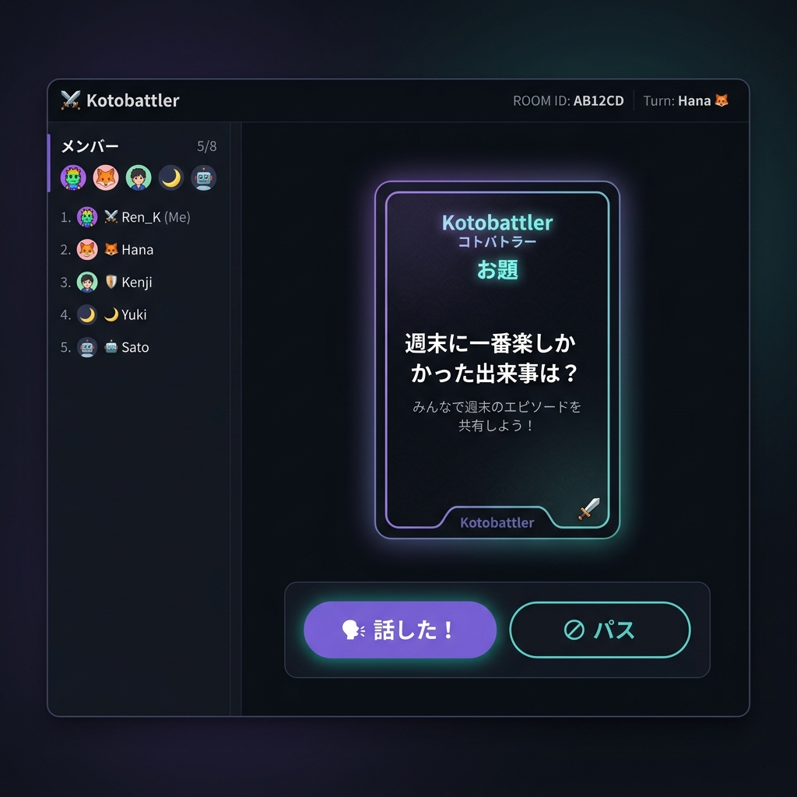

# コトバトラー (Kotobattler)

スプラトゥーンでVC中、ふと無言になる瞬間。
初対面でどこから話題を振ればいいのか分からない。
負けが続いてテンションが落ちた空気。
いや気まずーい！😂😂

そんな時片手でお題カードをサッめくって、変な空気を打開することを目指したVC・チャット特化型お題トーク支援ツール
沈黙打開"コトバトラー"！

シチュエーション毎にプリセットされたスターターデッキのほか、自分で会話デッキを作成することも可能。

個人情報は一切送信しない完全ローカル完結設計。
すべてのデータはブラウザの `LocalStorage` のみで安全に動作・保存されるため、自分以外にあなたのデッキを見られる心配はありません。

現在会話に参加中のナカマを入力することで、使った会話デッキの記録だけでなく、簡易的なメモも入力可能。
同じ人に何度も同じ話題を振ることなく、はじめましてでも安心してナカマを覚えることができます。

---

## メイン画面



---

## 主な機能

*   **直感的なフリック操作**  
    カードをスワイプ（またはクリック）して、「話した！」「パス」へスムーズに仕分け。片手操作モードを有効にすれば、キーボードショートカット（Spaceでめくる/Enterで話した/Backspaceでパスなど）でも操作可能です。
*   **空気感フィルターでトークをハック**  
    「はじめまして」「雑談」「メタ」「連敗中」「飲酒トゥーン」など、その場のリアルな雰囲気に合わせたお題のみを瞬時にフィルタリング。
*   **メンバー管理＆自動記憶**  
    一緒に遊ぶメンバーを登録してお題の消化状況を管理。「前回のメンバー選択を記憶する」機能により、次回のVCもスムーズに再開できます。
*   **インタラクティブな☆評価＆ドラッグ調整**  
    カードをめくった際、星マークの上でマウスやタッチを左右にドラッグ（スライド）するだけで、星の数を1〜5にスムーズに増減できます（フリップ動作と干渉しないスマート設計）。
*   **ロッカーからのクイック編集**  
    お題はロッカーで一覧管理。編集画面を開くことなく、一覧から直接星評価をクリックしてインライン編集・保存が可能です。
*   **CSVによる完全データ管理**  
    スターターデッキは外部の `starter_cards.csv` で一元管理。ビルド時にプレビルドアクションが走り、TSファイルへと自動変換されます。人物墓地設定（`once_per_person` など）や出現ルールもCSV側から100%制御できます。
*   **一括フルバックアップ**  
    作成したお題や登録メンバー情報などは、設定タブからJSONファイルとして一括でバックアップ・復元できます。

---

## 使い方

### 1. メンバーをセットする
1. 画面右上の **「メンバー」** タブを開き、よく一緒に遊ぶプレイヤーを登録します。
2. **「セッション開始」** ボタンを押し、今回VCにいるメンバーにチェックを入れます。

### 2. 空気感（フィルター）を選ぶ
*   上部の空気感フィルター（例：「はじめまして」「連敗中」など）を選択すると、そのシーンに最適化されたお題デッキが自動セットされます。

### 3. カードをめくって話す！
*   **話した！**: カードを上にフリック、または「話した！」ボタンを押します。お題が消化され、次のカードへ進みます。
*   **パス**: カードを右にフリック、または「パス」ボタンを押します。
*   **評価を変える**: カード裏面の星マークを左右にスライドして、お題の「面白さ・難易度」を直感的に評価できます。

---

## 開発者向け

Next.js 16 (TypeScript / Tailwind CSS / Turbopack) で構築されています。

### ローカル起動
```bash
# パッケージのインストール
npm install

# 開発サーバー起動
npm run dev
```
起動後、ブラウザで [http://localhost:3000](http://localhost:3000) を開きます。

### スターターデッキの更新
`src/data/starter_cards.csv` を編集した後、以下のビルドを行うか、手動でジェネレーターを叩くことで `starterDeck.ts` が自動生成されます。
```bash
# CSVからTSへの自動ビルドを実行
npm run build

# またはジェネレータースクリプトを直接実行
node scripts/generateStarterDeck.js
```
